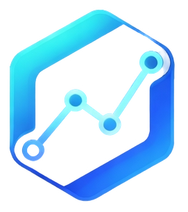

# 🚀 VectorForgeML
### High-Performance Machine Learning Framework for R & C++

[](https://cran.r-project.org/package=VectorForgeML)

[](LICENSE)


<p align="center">
  
</p>

---

## 📌 Overview

**VectorForgeML** is a next-generation machine learning framework designed to bridge the gap between **R's simplicity** and **C++'s raw performance**. Built from scratch, it focuses on understanding the mathematical foundations of ML while delivering a scalable, production-ready systems architecture.

Unlike traditional R packages that simply wrap C libraries, **VectorForgeML** implements core algorithms using:
- **Raw C++ Pointers** for graph-based models (Decision Trees, Random Forests)
- **BLAS & LAPACK** for hardware-accelerated Linear Algebra
- **OpenMP** for multi-core parallelism
- **Zero-Copy** data exchange between R and C++

The goal is to provide a **Research-Ready Engine** that allows data scientists to build complex pipelines in milliseconds.

## Research Paper

The official research paper describing VectorForgeML is available here:

[VectorForgeML Paper](paper/VectorForgeML_Paper.pdf)

---

## ⚡ Key Features

- **🚀 Blazing Fast**: Optimized C++ backend ensures models train in record time compared to standard R implementations.
- **🔗 Modular Design**: Component-based architecture with full support for **Pipelines** (`ColumnTransformer`, `StandardScaler`, `PCA`, etc.).
- **🔧 Hardware Acceleration**: Native integration with BLAS/LAPACK for matrix operations.
- **📉 Memory Efficient**: Custom allocators and index-based views (no deep copies).
- **🛠 Zero Dependencies**: Core algorithms are implemented without heavy external ML dependencies.

---

## 🎉 Officially on CRAN

VectorForgeML is officially published on CRAN and distributed globally.

### Install from CRAN (Recommended)

```r
install.packages("VectorForgeML")
library(VectorForgeML)

```

---

## 🧠 Algorithms & Notebooks

We have implemented a wide range of algorithms, verified with real-world datasets on **Kaggle**.

### 🔹 Supervised Learning (Regression & Classification)

| Algorithm | Type | Description | Kaggle Demo |
|-----------|------|-------------|-------------|
| **Linear Regression** | Regression | OLS with BLAS/LAPACK optimization. | [View Notebook](https://www.kaggle.com/code/almusheer/linear-regression-vectorforgeml) |
| **Logistic Regression** | Classification | Gradient Descent with Sigmoid activation. | [View Notebook](https://www.kaggle.com/code/almusheer/logistic-regression-vectorforgeml) |
| **Ridge Regression** | Regression | L2 Regularized Linear Regression using Cholesky. | [View Notebook](https://www.kaggle.com/code/almusheer/ridge-regression-vectorforgeml) |
| **Softmax Regression** | Classification | Multi-class classification with Log-Sum-Exp trick. | [View Notebook](https://www.kaggle.com/code/almusheer/softmax-regression-vectorforgeml) |
| **Decision Tree** | Reg/Class | Recursive partitioning with distinct C++ graph pointers. | [View Notebook](https://www.kaggle.com/code/almusheer/decision-tree-vectorforge-ml) |
| **Random Forest** | Ensemble | Parallelized ensemble of decision trees. | [View Notebook](https://www.kaggle.com/code/almusheer/randomforest-vectorforgeml) |
| **KNN** | Reg/Class | K-Nearest Neighbors with `std::partial_sort` optimization. | [View Notebook](https://www.kaggle.com/code/almusheer/knn-vectorforgeml) |

### 🔹 Unsupervised Learning

| Algorithm | Type | Description | Kaggle Demo |
|-----------|------|-------------|-------------|
| **K-Means Clustering** | Clustering | Lloyd's algorithm with efficient centroid updates. | [View Notebook](https://www.kaggle.com/code/almusheer/kmeans-vectorforgeml) |
| **PCA** | Dim. Reduction | Principal Component Analysis via SVD/Eigen Decomposition. | [View Notebook](https://www.kaggle.com/code/almusheer/decision-tree-vectorforge-ml) |

### 🔹 Utilities & Pipelines

| Feature | Description | Kaggle Demo |
|---------|-------------|-------------|
| **Pipeline** | Chain multiple steps (Preprocessing -> Model) into one object. | [View Notebook](https://www.kaggle.com/code/almusheer/pipeline-vectorforgeml) |
| **Preprocessing** | `StandardScaler`, `MinMaxScaler`, `LabelEncoder`, `OneHotEncoder`. | Included in Pipeline Demo |
| **Metrics** | `accuracy_score`, `r2_score`, `f1_score`, `confusion_matrix`. | Included in all Demos |

---

## 🚀 Quick Start Example

Here is how you can build a powerful pipeline in just a few lines of R:

```r

install.packages("VectorForgeML")
library(VectorForgeML)

df <- read.csv(system.file("dataset","winequality.csv", package="VectorForgeML"),sep=";")
y <- df$quality
X <- df; X$quality<-NULL

split <- train_test_split(X,y,0.2,42)

cat_cols <- names(X)[sapply(X,is.character)]
num_cols <- names(X)[!sapply(X,is.character)]

pre <- ColumnTransformer$new(
  num_cols,cat_cols,
  StandardScaler$new(),
  OneHotEncoder$new()
)

pipe <- Pipeline$new(list(
  pre,
  RandomForest$new(ntrees=100,max_depth=7,4,mode="classification")
))

pipe$fit(split$X_train,split$y_train)
pred <- pipe$predict(split$X_test)

cat("Accuracy:",accuracy_score(split$y_test,round(pred)),"\n")
```

---

## 🏗 Project Structure

```bash
VectorForgeML/
├── R/                  # R interface & utility functions
├── src/                # High-performance C++ backend
│   ├── LinearRegression.cpp
│   ├── DecisionTree.cpp
│   ├── RandomForest.cpp
│   └── ...
├── include/            # C++ Header files
├── public/             # Documentation Website (VectorForgeML.com)
├── scripts/            # Build & Doc generation scripts
└── README.md           # Project Documentation
```

---

## 👨‍� Developer

**Mohd Musheer**  
*Lead Developer & Architect*

Passionate about High-Performance Computing (HPC) and System Design. VectorForgeML is a testament to building systems from first principles—combining rigorous mathematics with software engineering excellence.

---

## 📖 Citation

If you use VectorForgeML in research, please cite:

Musheer, M. (2026). VectorForgeML: High-Performance Machine Learning Framework. CRAN.  
DOI: 10.32614/CRAN.package.VectorForgeML

## Hackathon Submission

This project was submitted to the **Quantum Sprint Hackathon 2026** on Devpost.

VectorForgeML is a high-performance machine learning framework with a C++ backend designed to accelerate model training in R.

Resources:
- Documentation: https://documentation.work.gd
- CRAN Package: https://cran.r-project.org/package=VectorForgeML
- Research Paper: paper/VectorForgeML_Paper.pdf

## Hackathon
Submitted to: Quantum Sprint Hackathon 2026

## 📜 License

This project is licensed under the **Apache License 2.0**.

---

<p align="center">
  Made with ❤️ by <b>Mohd Musheer</b>
</p>